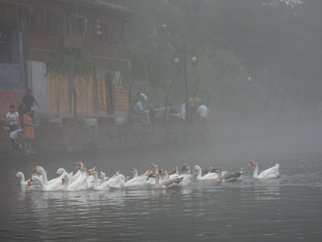
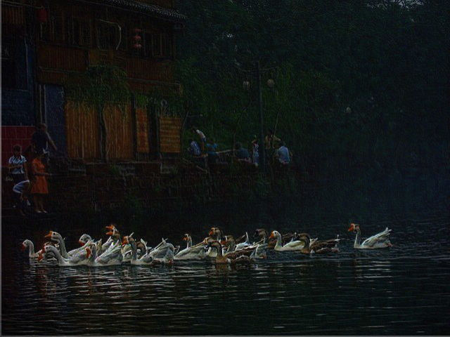
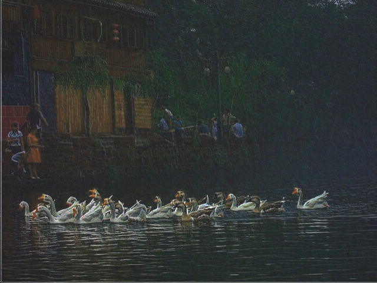
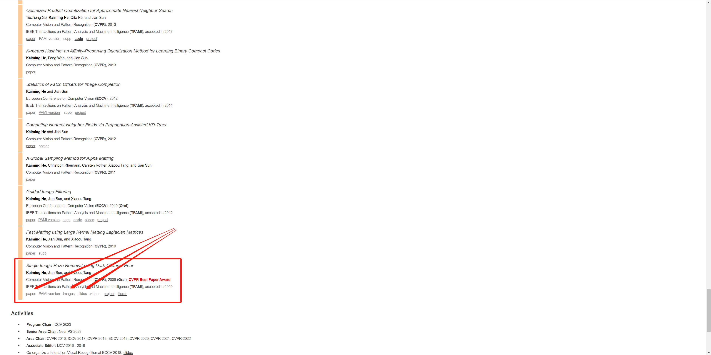

# 基于暗通道先验去雾算法的FPGA实现

## Introduction

​	C代码中有加导向滤波，实际上效果会好很多，但是FPGA实现的时候没有加上去，目前实现了图像的去雾，图片的A值是用上一帧的A值作为现有帧的A值，实际上应用的话应该不会有太大影响。

​	原提交版本实现了去雾，但是如图二所示，结果比较暗，通过调整Y值，使图片相对显示的正常一些。

​	建议看一下何凯明的那篇论文，讲的还是很清楚的，fpga上实际上粗糙的实现了功能。

​	这个工程是基于暗通道先验去雾算法的FPGA实现，并未使用一些IP，可通过选择流水等级实现高精准度，求最小值卷积窗利用FIFO实现，所有代码由Verilog编写，将很便利的移植到各种开发平台上，如Altera与Xilinx的各类型号fpga，其中**主要**的工程文件如下:

- ***pic***

- ***QuestaSim***

- ***RTL***

​	其中**pic**文件夹存放着用来仿真及结果存储的仿真图像，**QuestaSim**文件夹中存放着Modelsim仿真的工程（为空），**RTL**文件夹为整个工程源码及仿真源码，请把modelsim工程创建到Questasim文件夹，添加RTL文件下所有源文件，选择顶层***image_process***进行仿真，工程需仿真***14ms***才能出现结果。

如果有问题欢迎提交，如果有帮助的话，不要忘记点赞关注哦！

## 效果展示

## Reference

何凯明个人主页，论文+SLIDE

https://kaiminghe.github.io/

> 1.Single Image Haze Removal Using Dark Channel Prior
>
> 2.Guided Image Filtering

相关介绍：

https://www.jianshu.com/p/df9c963a392a

[暗通道先验去雾（single image haze removal using dark channel prior） - 知乎 (zhihu.com)](https://zhuanlan.zhihu.com/p/28875405)

公式推导：

https://zhuanlan.zhihu.com/p/438206777

[(34条消息) 导向滤波(Guided Filter)公式详解_lsflll的博客-CSDN博客_导向滤波](https://blog.csdn.net/weixin_43194305/article/details/88959183)

## Tips：

​	本工程中的仿真文件中读取bmp与保存bmp用的读取函数都是使用***相对路径***，如果不想自己重新切换下路径的话，上述三个文件夹及Vivado工程创建路径需与此教程一致。

​	本工程中modelsim与vivado可以使用***Modelsim Simulator***或者***Vivado Simulator***自带的仿真器进行仿真，本开源工程利用仅在vivado中添加***canny_header***这个头文件，以实现两个仿真器随意运行，全部代码全在***canny_edge_detection***下的.src文件夹内，顶层为**image_process.sv**。工程需仿真***14ms***才能出现结果，Vivado仿真比较慢，推荐使用Modelsim仿真。

​	要进行处理的图片需经过win10自带的3D绘图保存为640*480大小的bmp，可以查看大小是否为9k来验证图片是否可以应用仿真。

​	有完整C++实现代码，PPT里面有算法具体实现的思路，如有疑惑欢迎提交补充。

**走过路过，不要忘记点赞关注订阅哟！**
