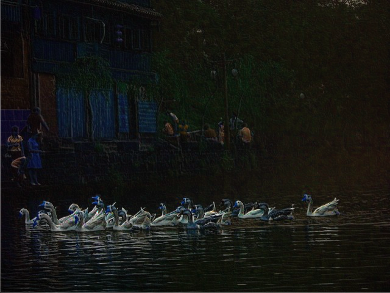

利用FPGA实现暗通道先验的去雾算法，考虑加上导向滤波，研发中。。。。。。

C代码中有加导向滤波，实际上效果会好很多，目前只是实现了图像的去雾，图片的A值是用上一帧的A值作为现有帧的A值，实际上应用的话应该不会有太大影响。

刚写没多久，如果有问题欢迎提交

如果有帮助的话，不要忘记点赞关注哦！

email：1135820735@qq.com 有疑惑的话欢迎email我

## Reference

相关介绍：

https://www.jianshu.com/p/df9c963a392a

[暗通道先验去雾（single image haze removal using dark channel prior） - 知乎 (zhihu.com)](https://zhuanlan.zhihu.com/p/28875405)

公式推导：

https://zhuanlan.zhihu.com/p/438206777

[(34条消息) 导向滤波(Guided Filter)公式详解_lsflll的博客-CSDN博客_导向滤波](https://blog.csdn.net/weixin_43194305/article/details/88959183)

FPGA仿真框架：

大磊FPGA，哔哩哔哩同名

感谢各位大佬无偿写的一些blog，及一些比较完善代码框架，希望能让喜欢这个行业的人更快的上手。
