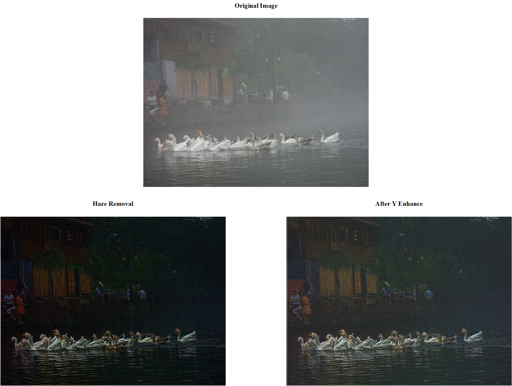

## 基于暗通道先验去雾算法的FPGA实现

有完整C++实现代码，PPT里面有算法具体实现的思路，如有疑惑欢迎提交补充。

如果有帮助的话，不要忘记点赞关注订阅哦！

### Introduction

​	这个工程是基于暗通道先验去雾算法的FPGA实现，其中最小值卷积窗利用FIFO实现，可通过提高流水级数实现高精准度。所有代码由Verilog编写，并未使用一些IP，将很便利的移植到各种开发平台上，如Altera与Xilinx的各类FPGA。	

​	C代码中有加导向滤波，实际上效果会好很多，但是FPGA实现的时候没有加上去，目前实现了图像的去雾，图片的A值是用上一帧的A值作为现有帧的A值，实际上应用的话应该不会有太大影响。

​	原提交版本实现了去雾，但是如效果展示图所示，结果比较暗，当前版本通过调整Y值，使图片相对显示的正常一些。

​	建议看一下何凯明的那篇论文，讲的还是很清楚的，FPGA上实际上粗糙的实现了功能。

### Folder Structure

​	其中***RTL工程***文件如下:

> | Folder |             Function              |
> | :-------------------------------: | :----------------------------------------------------------: |
> |            ***1.RTL***            |                 #存放着所有源代码及仿真代码                  |
> |      ***4.Vivado_Project***       | #工程及波形文件（当前版本**Vivado2023.2**，仅供参考，建议自行创建工程） |
> |         ***5.QuestaSim***         | #存放Modelsim/QuestaSim的工程（为空，需自己创建工程至此目录） |

注：请把Modelsim工程创建到Questasim文件夹，添加RTL文件下所有源文件，选择顶层***haze_removal_tb.sv***进行仿真，工程需仿真***14ms***才能出现结果。

​	其中***验证工程***如下:

> | Folder |             Function              |
> | :-------------------------------: | :----------------------------------------------------------: |
> |         ***2.C++_Model***         | #基于opencv验证的暗通道先验去雾算法的验证方案（自行配置opencv环境） |
> |       ***3.Matlab_Model***        |           #提高亮度以使去雾图片看起来正常点的代码            |

​	***PPT演示文档***如下：

https://docs.google.com/presentation/d/1hftrReSJX6RB1ljNpfOpNf5uYBZNhLuOinfR8WJm7VA/edit?usp=sharing

### Reference

何凯明个人主页（内有论文、SLIDE）

> https://kaiminghe.github.io/
>
> - 1.Single Image Haze Removal Using Dark Channel Prior
>
> - 2.Guided Image Filtering

去雾算法相关介绍：

> https://www.jianshu.com/p/df9c963a392a
>
> [暗通道先验去雾（single image haze removal using dark channel prior） - 知乎 (zhihu.com)](https://zhuanlan.zhihu.com/p/28875405)

部分公式推导：

> https://zhuanlan.zhihu.com/p/438206777
>
> [(34条消息) 导向滤波(Guided Filter)公式详解_lsflll的博客-CSDN博客_导向滤波](https://blog.csdn.net/weixin_43194305/article/details/88959183)

### Tips：

​	本工程中的仿真文件中读取bmp与保存bmp用的读取函数都是使用***相对路径***，如果不想自己重新切换下路径的话，上述三个文件夹及Vivado工程创建路径需与此教程一致。

​	本工程可以使用***Modelsim Simulator***或者***Vivado Simulator***进行仿真，仅需在仿真顶层**haze_removal_tb.sv**的4-5两行注释另一仿真器代码，即可实现两个仿真器任意运行。但Vivado仿真比较慢，推荐使用Modelsim仿真。

​	要进行处理的图片需经过win10自带的3D绘图保存为对应尺寸的bmp，可以查看大小是否正确来验证图片是否可以应用仿真。(如输入640x480的图像，每个真彩色像素是3个字节，bmp的帧头是54个字节，可以自己算一下，该图像大小应为640x480x3+54=900KB)

**走过路过，不要忘记点赞关注订阅哟！**
